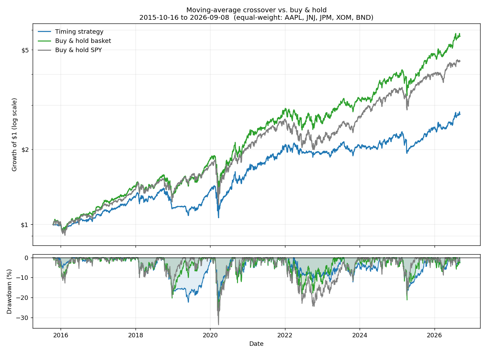

# Moving Average Crossover Backtester

A Python backtest of a classic **50-day / 200-day moving average crossover**
("golden cross" / "death cross") trading strategy, run on five stocks plus a
buy-and-hold benchmark, with an explicit no-lookahead-bias backtest engine and
a simple transaction-cost model.

Built as a portfolio project to demonstrate: pulling and cleaning real market
data, implementing a rule-based trading signal correctly, backtesting it
without cheating, and evaluating the result with the standard risk/return
metrics used in finance.



## The strategy, in plain English

For each stock, track two moving averages of its closing price: a fast one
(50 trading days, ~2.5 months) and a slow one (200 trading days, ~10 months).

- When the fast average crosses **above** the slow average (a **golden
  cross**), the recent trend is stronger than the long-term trend → **buy**.
- When the fast average crosses **below** the slow average (a **death
  cross**), the recent trend has turned down → **sell**, move to cash.

It's a trend-following rule: it tries to ride sustained moves and sit out
sustained declines, at the cost of reacting late to both.

## Universe

| Role      | Symbols                    |
|-----------|-----------------------------|
| Holdings  | AAPL, JNJ, JPM, XOM, BND    |
| Benchmark | SPY (tracks the S&P 500)   |

Five very different names on purpose: a large-cap grower (AAPL), a slow
defensive stock (JNJ), a bank that's sensitive to rates and credit cycles
(JPM), a commodity-driven cyclical (XOM), and a bond ETF (BND) that behaves
nothing like the other four. The strategy meets a range of conditions rather
than being flattered by one.

## Methodology

**Data.** Daily prices from Yahoo Finance via `yfinance`, downloaded
**split- and dividend-adjusted** (`auto_adjust=True`), so a stock split or a
dividend payment doesn't look like a price crash and total return includes
income, not just price appreciation. Prices are cached locally as CSVs so
repeated runs don't re-hit the API.

**No lookahead bias.** A moving average that ends on today's close isn't
knowable until the market has closed — you can't act on it until the next
trading day. The signal is computed from data available *as of* today, then
shifted forward one day before it's used to size a position. Every return
calculation multiplies that lagged position by the *next* day's return, never
the same day's. See [src/strategy.py](src/strategy.py) for the exact mechanics.

**Transaction costs.** Every time the position flips (buy or sell), 0.1% of
the traded value is deducted that day. This is a simple proportional-cost
model applied uniformly — see [Limitations](#limitations) for what it leaves
out.

**Three curves, compared on the identical window** — this is what separates
"did market-timing help?" from "did picking these five stocks help?":

1. **Timing strategy** — the crossover rule applied to the five stocks,
   equal-weighted, capital split once at the start and never rebalanced.
2. **Buy & hold basket** — the same five stocks, same equal weights, held
   the whole time with no trading in or out.
3. **Buy & hold benchmark** — SPY, bought once and held.

All three start on the first date every stock's 200-day average has enough
history to exist, and run to the most recent available trading day.

**Metrics.** Total return, CAGR (compound annual growth rate, based on actual
elapsed calendar time), annualized volatility, Sharpe ratio (mean daily
excess return over its standard deviation, annualized; risk-free rate
currently set to 0%), max drawdown (worst peak-to-trough fall), and Calmar
ratio (CAGR / |max drawdown|). Formulas and reasoning are documented in
[src/metrics.py](src/metrics.py).

## Project layout

```
ma-crossover-backtester/
├── main.py               # runs the full pipeline end to end
├── README.md
├── requirements.txt
├── data/                 # cached price CSVs (git-ignored, auto-created)
├── output/               # generated chart(s) (git-ignored, auto-created)
└── src/
    ├── config.py         # every parameter: tickers, dates, windows, costs
    ├── data_fetch.py     # download + cache daily prices from Yahoo Finance
    ├── strategy.py        # moving averages -> lagged buy/sell signal
    ├── backtest.py        # signals -> daily returns, costs, equity curves
    ├── metrics.py          # CAGR, Sharpe, drawdown, Calmar, comparison table
    └── plot.py             # equity curve + drawdown chart
```

Each stage is independently runnable and testable:

```bash
python -m src.data_fetch     # prints a summary of the downloaded data
python -m src.strategy       # prints the crossover trade history per stock
python -m src.backtest       # prints headline returns for all three curves
python -m src.metrics        # prints the full metrics comparison table
python -m src.plot           # saves output/equity_curve.png
```

## Setup

```bash
git clone <this-repo-url>
cd ma-crossover-backtester
python3 -m venv .venv
source .venv/bin/activate        # Windows: .venv\Scripts\activate
pip install -r requirements.txt
```

## Usage

```bash
python main.py            # uses cached data if present
python main.py --refresh  # forces a fresh download from Yahoo Finance
```

This fetches data, runs the backtest, prints the metrics table, and writes
`output/equity_curve.png`.

## Results (snapshot)

Numbers below are from a run ending **2026-09-08** and will shift on a
re-run as new price data comes in — they're illustrative of what the tool
reports, not a fixed claim.

| Metric | Timing strategy | Buy & hold basket | Buy & hold SPY |
|---|---:|---:|---:|
| Total return | 175.8% | 466.0% | 350.6% |
| CAGR | 9.8% | 17.2% | 14.8% |
| Ann. volatility | 13.4% | 17.5% | 17.7% |
| Sharpe ratio | 0.76 | 1.00 | 0.87 |
| Max drawdown | −25.6% | −31.3% | −33.7% |
| Calmar ratio | 0.38 | 0.55 | 0.44 |

**Reading it honestly:** the crossover rule did lower volatility and shrink
the worst drawdown a bit — it's doing its intended job to some degree. But it
gave up much more upside than it saved in downside: its Sharpe and Calmar
ratios are the worst of the three, and it still fell alongside everything
else in the fast 2020 crash (a 50/200-day filter is far too slow to react to
a four-week collapse). The best-performing approach in this run was simply
holding the five stocks with no trading at all. That's a legitimate,
reportable finding — the value of a backtest is finding this out before
risking real money on it, not making the strategy look good.

## Limitations

This is a simplified, educational backtest. Known gaps, stated plainly:

- **No slippage or liquidity modeling.** Trades are assumed to fill exactly
  at the recorded close with no market impact. In reality, a large or
  poorly-timed order moves the price against you.
- **No bid/ask spread**, beyond the flat 0.1% cost assumption, which is a
  rough stand-in for both commission and spread combined, not a real
  execution-cost model.
- **Cash earns 0%.** While the strategy is "out of the market," idle capital
  is not earning a money-market or T-bill return, which flatters buy-and-hold
  less than it should versus the timing strategy in real life.
- **No rebalancing.** The equal-weight allocation is set once and left to
  drift; a portfolio manager might periodically rebalance, which would change
  the results.
- **One fixed parameter set (50/200), never tuned or validated.** These are
  the conventional textbook values, not the result of optimizing against this
  data — which is good practice (optimizing on the test data would be
  overfitting) but also means no claim is made that 50/200 is "best."
- **Small, non-random universe.** Five stocks chosen by the user, not drawn
  from a broad or randomized sample, and there's no survivorship-bias
  control — all five are companies (and the benchmark) that still exist and
  are easy to find data for today.
- **Whole-position sizing only.** The strategy is always either 100% in a
  name or 0%, with no partial sizing, leverage, or stop-losses.
- **Ignores taxes.** Realized gains and losses have no tax treatment applied.
- **Single, specific historical window** (2015–2026). Results are sensitive
  to the exact start/end dates and this period includes both a long bull
  market and a very sharp, unusual crash (COVID-19), which may not be
  representative of other periods.
- **Past performance does not predict future results.** This applies to both
  the individual stocks and to the crossover rule itself — a strategy that
  under- or out-performed historically is not guaranteed to do the same going
  forward.

## Possible extensions

Ideas for taking this further, not implemented here:
- A real risk-free rate series (e.g. 3-month T-bill yield) instead of 0%, for
  both the Sharpe ratio and idle cash.
- Walk-forward or out-of-sample testing instead of one fixed window.
- Parameter sensitivity analysis (e.g. a heatmap of Sharpe ratio across a
  grid of short/long window combinations) to see how fragile the result is.
- Position sizing based on volatility rather than all-or-nothing.
- A broader, larger universe to reduce single-stock idiosyncrasy.

## Disclaimer

This project is for educational and portfolio purposes only. It is not
investment advice, and nothing here should be used to make real trading or
investment decisions.
